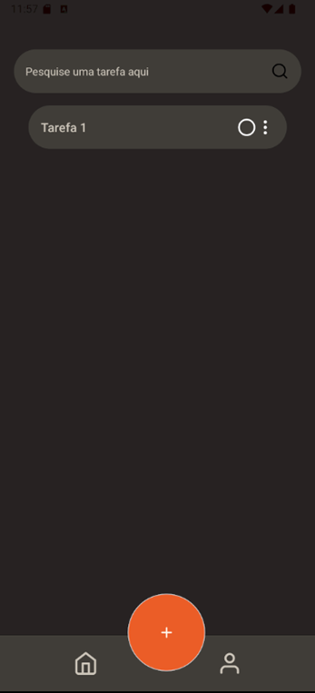
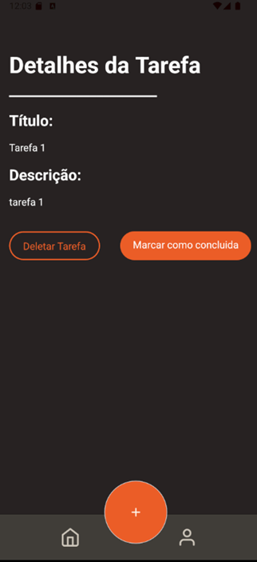
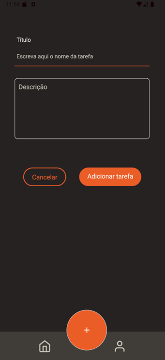

---

# App Lista de Tarefas

Este é um aplicativo de lista de tarefas simples e intuitivo, projetado para facilitar a organização do seu dia a dia. Com ele, você pode criar, visualizar e gerenciar suas tarefas de maneira rápida e eficiente.

## 📌 Funcionalidades

- Visualize suas tarefas na tela inicial.
- Crie novas tarefas com título e descrição.
- Gerencie tarefas com facilidade, acessando detalhes e ações relacionadas.

## 🎨 Design

O design do aplicativo pode ser visualizado no Figma:
[Figma - Design da Lista de Tarefas](https://www.figma.com/design/WxEmLLLEB76kjXP0kP9nSl/Lista-de-Tarefas?node-id=0-1&t=HdflMwapiZRflo9X-1)

## 🚀 Como Executar

Siga os passos abaixo para rodar o projeto localmente:

1. Clone o repositório:
   ```bash
   git clone https://github.com/RuanLMBS/apptask
   ```

2. Instale o [Node.js](https://nodejs.org/en/download/prebuilt-installer) e o [VS Code](https://code.visualstudio.com/Download).

3. Acesse a pasta do projeto clonado e certifique-se de que o repositório está atualizado:
   ```bash
   git pull
   ```

4. Instale as dependências do projeto:
   ```bash
   npm install expo-cli --global
   npm install
   npm install --force  # Caso enfrente problemas com versões de pacotes
   ```

5. Instale pacotes específicos:
   ```bash
   npm install styled-components
   npm install react@18.2.0 react-dom@18.2.0
   ```

6. Inicie o app:
   ```bash
   npx expo start
   ```

   Escaneie o QR code gerado com seu celular ou rode o app no navegador com:
   ```bash
   npx expo install react-native-web @expo/metro-runtime
   ```

## 🖼️ Screenshots

### Tela 1 – Home
A tela inicial exibe todas as tarefas do usuário. Há três botões na parte inferior: "Home", "Criar Nova Tarefa" e "Perfil".



### Tela 2 – Visualização de Tarefa
Na tela de visualização, o usuário pode acessar os detalhes da tarefa clicando nos três pontinhos ao lado dela, onde será possível marcar como concluída ou excluir a mesma.



### Tela 3 – Criação de Tarefa
A criação de uma nova tarefa é simples e intuitiva, com dois campos: título e descrição.



## 🛠️ Tecnologias Utilizadas

- [React](https://reactjs.org/) - Biblioteca JavaScript para construir interfaces de usuário.
- [Expo](https://expo.dev/) - Plataforma para desenvolvimento de apps React Native.
- [Styled-components](https://styled-components.com/) - Utilizado para estilização.

## 📝 Licença

Este projeto está licenciado sob a licença MIT.

---
